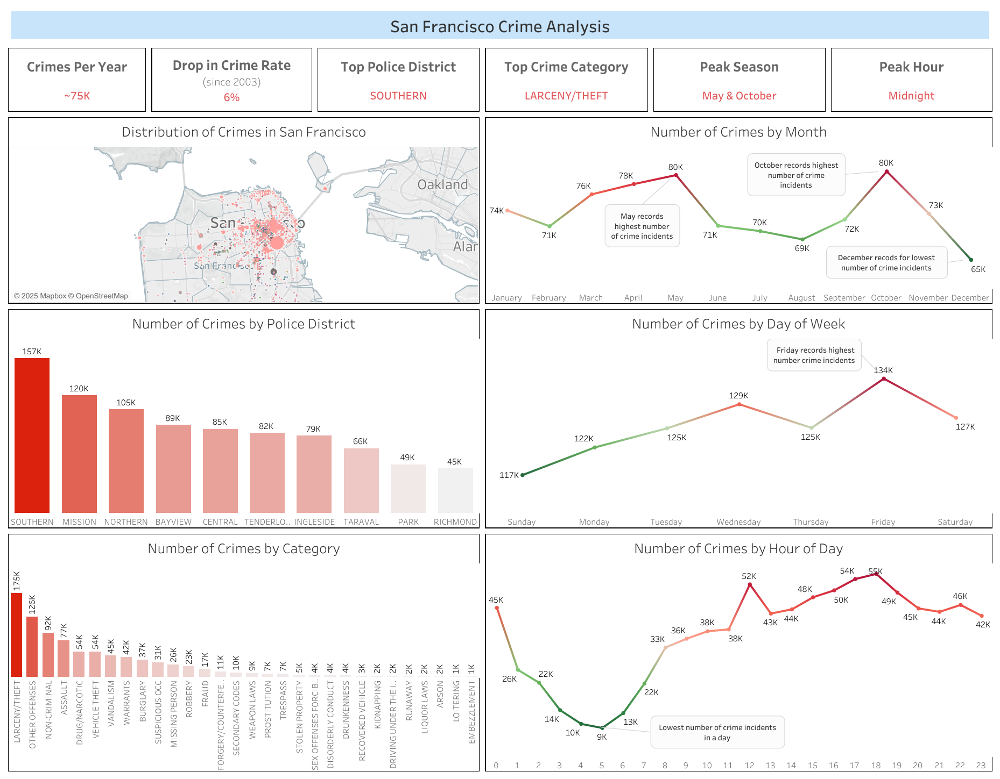

# San Francisco Crime Analysis



## 📌 Project Overview
This project focuses on analyzing and predicting crime patterns in San Francisco using large-scale crime datasets. It leverages **PySpark**, **XGBoost**, and **Tableau** to perform data preprocessing, model training, and visualization. The goal is to provide **actionable insights into crime trends**, assisting law enforcement and policymakers in crime prevention strategies.

## 🎯 Project Intentions
Leveraging my **machine learning expertise**, I built a **predictive crime analysis pipeline** that integrates **data scraping, processing, and visualization**. This system enhances the ability to **detect crime hotspots**, optimize resource allocation, and **forecast crime occurrences** based on historical trends.

Key Features:
- Scraped **380K+ crime records** from San Francisco’s open data API.
- Built a **PySpark-powered** ETL pipeline to process unstructured crime data efficiently.
- Applied **XGBoost** for **multi-class crime classification**, achieving a log-loss score of **2.86**.
- Developed an **interactive crime heatmap** using **Tableau**, visualizing crime distribution across **different neighborhoods**.

---

## 🔧 Tech Stack & Tools
| **Category**         | **Technologies Used** |
|----------------------|----------------------|
| **Data Scraping**    | BeautifulSoup, Open Data API |
| **Data Processing**  | PySpark, Pandas, NumPy |
| **Machine Learning** | XGBoost, Scikit-Learn |
| **Database**        | MySQL, Apache Spark |
| **Visualization**   | Tableau, Matplotlib, Seaborn |
| **Deployment**      | Flask API, AWS S3 |

---

## 📊 Data Sources
The dataset comes from **San Francisco Open Data**:
- [Crime Data API](https://data.sfgov.org/Public-Safety/Police-Department-Incident-Reports-2018-to-Present/wg3w-h783)

The script `get_data_from_api.py` automates fetching the latest **crime records**.

---

## 🚀 How to Run the Project

### 1️⃣ Clone the Repository
```sh
git clone https://github.com/SihanWang-WHU/SF-Crime-Analysis.git
cd SF-Crime-Analysis
```

### 2️⃣ Install Dependencies
```sh
pip install -r requirements.txt
```

### 3️⃣ Fetch Data
```sh
python get_data_from_api.py
```
This will retrieve **crime reports from the last 1500 days** and store them in `../Data/crime_records_1500.csv`.

### 4️⃣ Run Machine Learning Pipeline
```sh
python crime_prediction.py
```
This will **train the XGBoost model** and generate predictions for crime categories.

### 5️⃣ Open the Dashboard
The **Tableau Dashboard** provides an interactive **crime heatmap and analytical insights**:
- Open `Dashboard.png` for a preview.
- Full version available on **Tableau Public**: [Crime Analysis Dashboard](https://public.tableau.com/views/SF-Crime-Analysis/Dashboard).

---

## 📌 Key Insights from the Dashboard
🔹 **Crime Density Heatmap**: Visualizes high-risk areas based on historical crime records.  
🔹 **Crime by Time**: Shows hourly and weekly crime patterns, aiding in peak crime prediction.  
🔹 **Neighborhood Crime Trends**: Identifies the safest and most dangerous districts in SF.  

---

## 💡 Future Improvements
- 🏗 **Integrate real-time crime alerts** by connecting the database to a web-based dashboard.
- 📡 **Expand to other cities** to create a scalable crime prediction framework.
- 🎯 **Enhance model performance** using **deep learning** techniques (e.g., RNNs for time-series crime forecasting).

---

## 📬 Contact & Contributions
👤 **Sihan Wang**  
📧 siw045@ucsd.edu  
🔗 [LinkedIn](http://www.linkedin.com/in/sihanwang-riddle)

🎯 **Contributions are welcome!** Feel free to open an issue or submit a pull request. 🚀
